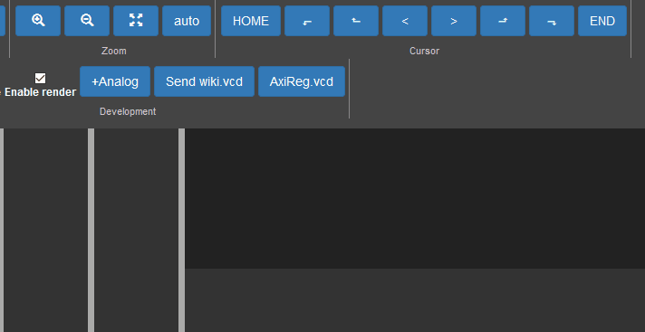

# fliplot

HTML based waveform viewer for HDL simulators.

Fliplot is an alternative to GTKWave, but this is implemented in HTML, Javascript and Python, which
make Fliplot *scriptable*, *pluginable*, *portable*.

See demo at: http://raczben.pythonanywhere.com/



# Contribution

Here are the basic steps to start development.

### Requirements

Requires nodejs `>=14.18.0` and python `>=3.9`.

For parsing vcd files, we use our [vcd-parser](https://github.com/cs233/vcd-parser) library which is included in Fliplot as a local dependency. Clone the `cs233/vcd-parser` repo into the same directory where you will clone this Fliplot repo (i.e. it should be side-by-side with `fliplot` and not inside it).

### Start development server

 0. Clone and enter to this repo.
 1. Install javascript dependencies: `npm i`
 2. Bundle js sources: `npx webpack --mode=development --watch` 
 3. Create and activate a new python virtual-environment (optional): `python3 -m  virtualenv .venv` `./.venv/bin/activate`
 4. Install python dependencies: `pip install flask`
 5. Start flask server:
    
```bash
 export FLASK_APP=flask_app
 export FLASK_ENV=development
 flask run 
```
